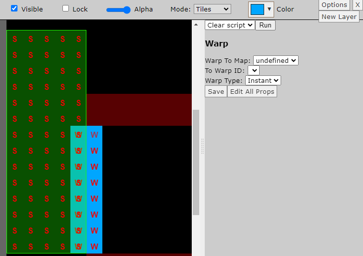
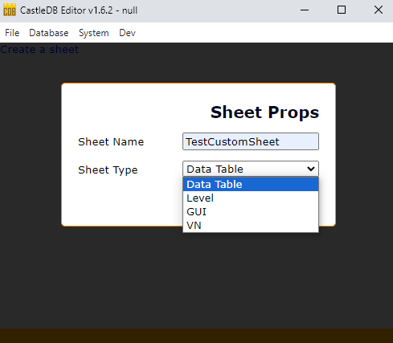
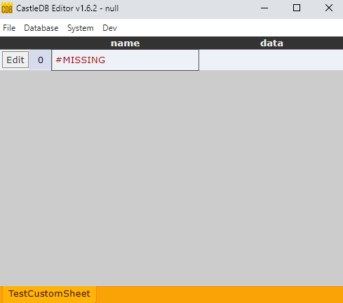
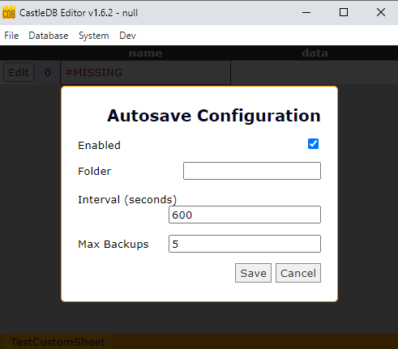
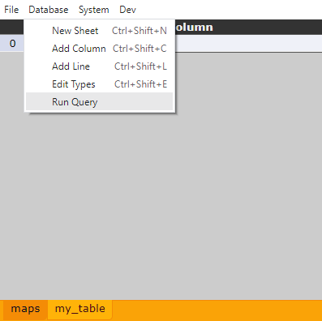
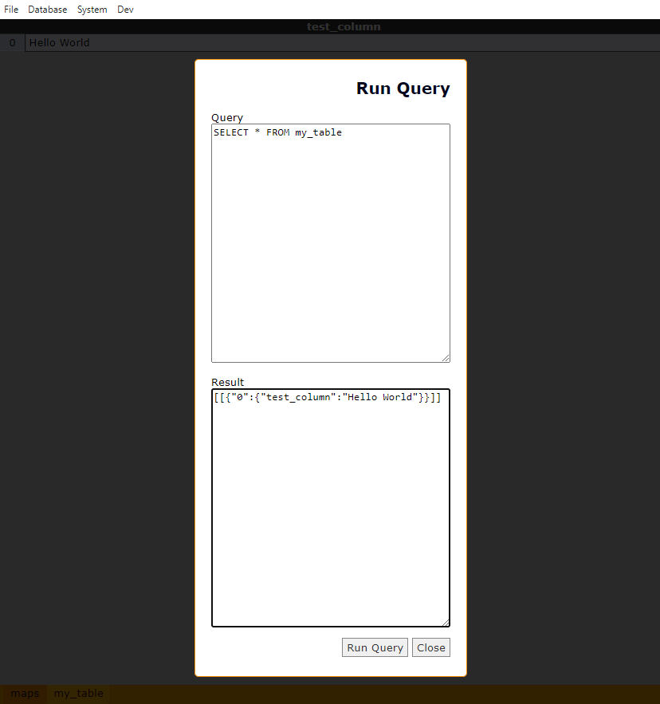

This is a WIP repo which includes all my personal setup for Castle DB with many customizations. Eventually I will release a version for public usage but right now I'm still ironing everything out.

This is a clone of https://github.com/dazKind/castle which is a fork of https://github.com/ncannasse/castle meant to modernize the original Castle DB. I already have a fork of dazKind's repo with an open PR and instead of juggling branches/orgs to maintain the change tree I'm just cloning. These changes aren't designed to merge up anyway.

If you are interested in an expidited public release, you can email me at cgdev@airmail.cc and let me know. Right now this is just my dumping ground for all my current personal changes, which is updated erratically, and may or may not even work correctly on pull. But if there is a legitimate interest from anyone for this repo I will prioritize it.

FYI this repo will NOT be compatible with the CastleDB macro system. In general I don't support the use of the normal CastleDB macro system and would advise to use code generators instead.

## Customizations


#### Plugin system
hscript plugins can be placed in a ./plugins folder to extend the functionality.

Database plugins:

  1) Add custom scripts to context menu based on database sheet
  2) Edit the window menus via plugins

Tilemap mode plugins:

  1) Change the Edit Props form depending on the selected object
  2) Change the display of an object on the level
  3) Add scripts which can be chosen from the dropdown




#### Custom Views and Custom Sheet Types
The CustomView system allows for different sheet types, plugin-style. Just like the tilemap sheets of the original Castle DB launch an entire different editor, the CustomView system provides an easy way to write your own "sheet types" to launch per-row GUI controls. This lets CastleDB truly be an "everything" database. Check custom.CustomView.hx for info. It is currently working but the interface definitely needs some work. I'll add some examples once the concrete sets a little more.




#### Autobackup
Backups saved automatically



### Query system

~~CastleDB DOES have an unfinished SQL implementation in the source code but it is completely nonfunctional. I'm not interested in building out an entire SQL Parser AND implementing the logic. Instead, I've implemented common SQL commands by a normal API and then exposed them to a specific hscript context. So you can run these functions in a SQL-ish way, either programmatically or through plaintext via hscript.~~

Nevermind, I did in fact implement a SQL Parser (haxelib install hx-sql-parser) and incorporated it.




### Fixed the Palette View

The normal pallete component just literally renders the image of the tileset, which causes issues if the tileset is too big for the screen. Now it has a static size and scrolls, also you can zoom in/out to make extremely large palette selections if necessary. Additionally, the palette bar can be dragged around the screen.


Also, you can now right-click eyedrop entire selections.


# dazKind's documentation:


---


 
# CastleDB Editor

> **Important Note:** This is a fork of https://github.com/ncannasse/castle that resurrects & updates the old CastleDB Editor.

[http://castledb.org](http://castledb.org)'s editor is so outdated and no longer maintained, it's a crime.

Since it's a hidden gem and still super useful I decided to fork it here & update everything for 2024 together with some small UI fixes. 


---


# The original Documentation: 

CastleDB
========
<a href="http://castledb.org"></a>

**Important Note:** CastleDB editor has been rewritten to be integrated with [HIDE](https://github.com/heapsio/hide). Castle library is still being developped but the editor here is legacy.

_A structured database and level editor with a local web app to edit it._

### Why
CastleDB is used to input structured static data. Everything that is usually stored in XML or JSON files can be stored and modified with CastleDB instead. For instance, when you are making a game, you can have all of your items and monsters including their names, description, logic effects, etc. stored in CastleDB.

###  How
CastleDB looks like any spreadsheet editor, except that each sheet has a data model. The model allows the editor to validate data and eases user input. For example, when a given column references another sheet row, you will be able to select it directly.


###  Storage
CastleDB stores both its data model and the data contained in the rows into an easily readable JSON file. It can then easily be loaded and used by any program. It makes the handling of item and monster data that you are using in you video game much easier.

###  Collaboration
CastleDB allows efficient collaboration on data editing. It uses the JSON format with newlines to store its data, which in turn allows RCS such as GIT or SVN to diff/merge the data files. Unlike online spreadsheet editors, changes are made locally. This allows local experiments before either commiting or reverting.


### Download

##### Windows x64
http://castledb.org/file/castledb-1.5-win.zip
##### OSX x64
http://castledb.org/file/castledb-1.5-osx.zip
##### NWJS Package
http://castledb.org/file/package-1.5.zip  
> To run the package, download http://nwjs.io and put package.nw into the nwjs directory


### Compile from sources:

#### 1. Install Prerequisites
- Install [Haxe](https://haxe.org) using approriate installer from https://haxe.org/download/
- Install dependencies (https://github.com/HaxeFoundation/hxnodejs) using the command `haxelib install castle.hxml`

#### 2. Build castle.js
- Clone this repository
- At the root of the repository folder run
```haxe castle.hxml```
- This will create `castle.js` file in the `bin` folder

#### 3. Package or Run with NWJS
- Download and copy NWJS from http://nwjs.io into the bin/nwjs directory
- Run cdb.cmd on windows or nwjs/nwjs from bin directory on Linux
- On OSX, you need to copy all bin files into bin/nwjs.app/Contents/Resources/app.nw folder, then open the NWJS application

### More info
Website / documentation: http://castledb.org
